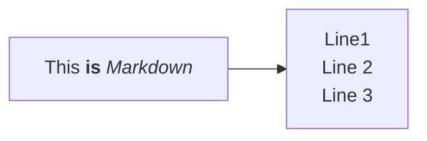

# Programação Orientada a Objetos





```python
class MinhaClasse:

	def __init__(self, info, elemento): # metodo construtor
		self.atributo_1 = 'meu atributo'
		self.atributo_2 = [1, 2, 'a']
		self.atributo_3 = elemento
		self.atributo_novo = info
		print(self.atributo_novo)

	def metodo_1(self):
		print('minha ação 1')
		print('minha ação 2')
		return 'olá mundo!'

	def metodo_2(self, numero):
		self.metodo_1()
		print(self.atributo_2[1] + numero)

# objeto       # classe -> instanciamos um objeto
minha_classe = MinhaClasse()

minha_classe.metodo_2(3)
```
